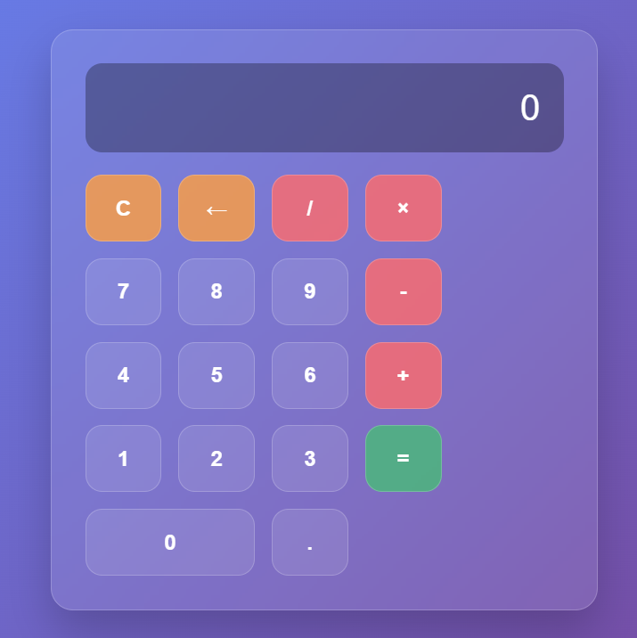

# Interactive Calculator

A modern, responsive calculator built with HTML, CSS, and JavaScript featuring a glassmorphism design.

## Features

- ✨ Modern glassmorphism UI design
- 📱 Fully responsive (works on mobile and desktop)
- ⌨️ Keyboard support
- 🧮 Basic arithmetic operations (+, -, ×, ÷)
- 🔢 Decimal number support
- 🚫 Error handling (division by zero)
- 🔄 Continuous calculations
- 🎯 Auto-calculation for chained operations

## How to Use

1. Open `index.html` in any modern web browser
2. Click buttons or use keyboard to input numbers and operations
3. Press `=` or `Enter` to calculate
4. Use `C` or `Escape` to clear
5. Use `←` or `Backspace` to delete last input

## Keyboard Shortcuts

- **Numbers (0-9)**: Input numbers
- **Operators (+, -, *, /)**: Mathematical operations  
- **Enter** or **=**: Calculate result
- **Escape** or **C**: Clear all
- **Backspace**: Delete last character
- **.**: Decimal point

## Technologies Used

- HTML5
- CSS3 (Grid, Flexbox, Glassmorphism effects)
- Vanilla JavaScript (ES6+)

## Live Demo

Simply download and open `index.html` in your browser to try it out!

## Screenshots

*Add a screenshot of your calculator here*

## Contributing

Feel free to fork this project and submit pull requests for any improvements!

## License

This project is open source and available under the [MIT License](LICENSE).
